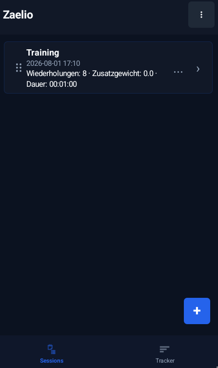

# 📊 Zaelio

Eine kleine Android-App zum Erstellen eigener Tracker, Starten von Sessions und Speichern von Messwerten lokal in SQLite.

Lizenz: MIT

## ✨ Features

- Eigene Tracker mit global sortierten Feldern erstellen; neue Elemente scrollen im Editor automatisch in den sichtbaren Bereich
- Sessions erfassen und fortsetzen, mit großen Plus/Minus-Buttons und Material-Feldern für Text, Zahlen und Timer
- Listen-Einträge per Long-Press, Links-Swipe oder `...`-Menü löschen
- Sessions und Tracker per Drag-Handle in der Übersicht sortieren
- Android-Zurück navigiert sinnvoll; auf Home beendet erst ein schneller Doppel-Zurück-Druck die App
- Werte lokal in SQLite speichern
- Tracker, Sessions oder komplette Backups als JSON importieren/exportieren
- Helles/dunkles Design, Schriftgröße, Akzentfarbe und globale Feldgröße einstellbar
- Kein Google Play Services, kein Firebase, keine Cloud

## 📱 Screenshots



## 🧰 Benötigte Abhängigkeiten

Zum Bauen brauchst du lokal:

- JDK 17 oder neuer
- Android SDK mit Platform `36`
- Android Build Tools passend zum SDK
- Gradle Wrapper aus diesem Repository (`./gradlew`)

Projektabhängigkeiten:

- Android Gradle Plugin `9.3.1`
- Gradle `9.5.1`
- Material Components `com.google.android.material:material:1.14.0`

Test-Abhängigkeiten:

- JUnit `4.13.2`
- AndroidX Test Core `1.7.0`
- Robolectric `4.16.1`
- ASM `9.10.1` für Robolectric auf modernen JDKs
- org.json `20260719`

Das Projekt nutzt absichtlich keine Google Play Services und kein Firebase.

## ⚙️ Einrichtung

Wenn dein Android SDK nicht automatisch gefunden wird, erstelle im Projektordner eine `local.properties`:

```properties
sdk.dir=/pfad/zu/deinem/Android/Sdk
```

Optional Java setzen:

```bash
export JAVA_HOME=/usr/lib/jvm/java-17-openjdk
```

## 🛠️ Debug-Build erstellen

```bash
./gradlew assembleDebug
```

Die APK liegt danach hier:

```text
app/build/outputs/apk/debug/zaelio-debug.apk
```

## 🚀 Release-Version erstellen

1. Version in `app/build.gradle` erhöhen:

```gradle
versionCode 2
versionName '1.1.0'
```

2. `CHANGELOG.md` aktualisieren.
3. Tests laufen lassen:

```bash
./gradlew testDebugUnitTest
```

4. Änderungen committen, Tag erstellen und pushen:

```bash
git status
git add app/build.gradle CHANGELOG.md README.md AGENTS.md
git commit -m "Prepare release 1.1.0"
git tag v1.1.0
git push origin main
git push origin v1.1.0
```

Wenn der Branch nicht `main` heißt, ersetze `main` durch den aktuellen Branch. Die GitHub Action baut aus dem Tag eine signierte Release-APK und hängt sie an den GitHub Release.

Tag prüfen oder bei Fehler löschen:

```bash
git tag
git show v1.1.0
git tag -d v1.1.0
git push origin :refs/tags/v1.1.0
```

## 🔐 Release signieren

Keystore erstellen:

```bash
keytool -genkeypair -v -keystore zaelio-release.jks -alias zaelio -keyalg RSA -keysize 4096 -validity 10000
```

Keystore als GitHub Secret ablegen:

```bash
base64 -w0 zaelio-release.jks
```

Benötigte GitHub Secrets:

```text
ANDROID_SIGNING_KEY_BASE64
ANDROID_KEYSTORE_PASSWORD
ANDROID_KEY_ALIAS
ANDROID_KEY_PASSWORD
```

Lokal kann eine signierte APK mit denselben Umgebungsvariablen gebaut werden:

```bash
ANDROID_KEYSTORE_PATH=/pfad/zu/zaelio-release.jks \
ANDROID_KEYSTORE_PASSWORD=... \
ANDROID_KEY_ALIAS=zaelio \
ANDROID_KEY_PASSWORD=... \
./gradlew assembleRelease
```

Ohne diese Variablen erzeugt Gradle weiterhin nur eine unsigned Release-APK. Release-Builds heißen `app/build/outputs/apk/release/zaelio.apk`, Debug-Builds `app/build/outputs/apk/debug/zaelio-debug.apk`.

## 📦 F-Droid

Vor der Einreichung bei F-Droid:

- `LICENSE` und `CHANGELOG.md` aktuell halten.
- Screenshots unter `docs/screenshots/` und für F-Droid/Fastlane unter `fastlane/metadata/android/en-US/images/phoneScreenshots/` ablegen.
- Pro Release `versionCode` erhöhen und einen Tag wie `v1.1.0` setzen.
- Prüfen, ob F-Droid die verwendete Kombination aus Android Gradle Plugin und `compileSdk` bauen kann.

Beispiel-Metadaten für `fdroiddata`:

```yaml
Categories:
  - Sports & Health
License: MIT
AuthorName: Zaelio
SourceCode: https://github.com/braunbearded/zaelio
IssueTracker: https://github.com/braunbearded/zaelio/issues
Changelog: https://github.com/braunbearded/zaelio/releases

RepoType: git
Repo: https://github.com/braunbearded/zaelio.git

Builds:
  - versionName: 1.0.1
    versionCode: 2
    commit: v1.0.1
    gradle:
      - yes

AutoUpdateMode: Version v%v
UpdateCheckMode: Tags
CurrentVersion: 1.0.1
CurrentVersionCode: 2
```

## 📁 Projektstruktur

```text
app/src/main/java/com/zaelio/app/
├── MainActivity.java              # Routing, Lifecycle, Top Bar, Navigation
├── TrackingDatabase.java          # SQLite Schema v6, Migrationen, Datenzugriff
├── TrackerJsonRepository.java     # JSON Import/Export und Tracker-Speicherung
├── BackupJsonRepository.java      # JSON Backup für Tracker, Sessions und Werte
├── JsonUtil.java                  # JSON-Helfer
├── FormatUtil.java                # Gemeinsame Formatierung
├── Models.java                    # Datenmodelle
├── HomeUi.java                    # Session-/Tracker-Übersicht
├── ReorderHelper.java             # Gemeinsames Drag-Reorder-Verhalten
├── TrackerFlowUi.java             # Tracker-Editor und Session-Routing
├── FieldInputUi.java              # Eingabefelder, Timer und Zahlensteuerung
├── theme/ThemeStore.java          # Theme, Akzentfarbe, Schrift- und Feldgröße
└── ui/
    ├── AppUi.java                 # Gemeinsame UI-Bausteine
    └── SettingsUi.java            # Einstellungen und Über-Screen
```

## 🧪 Tests

Lokale Unit-Tests laufen mit JUnit und Robolectric:

```bash
./gradlew testDebugUnitTest
```

Aktueller Fokus:

- `JsonUtilTest` prüft JSON-Roundtrips und Tracker-Export.
- `TrackingDatabaseTest` prüft Seed-Daten, Sessions, Records, Previous Values, Löschlogik, Übersichtssortierung und Migration auf Schema v6.
- `BackupJsonRepositoryTest` prüft alle Backup-Export/Import-Varianten gegen Beispiel-JSON unter `app/src/test/resources/backup-fixtures/`.

Zusätzlicher Build-Check:

```bash
./gradlew assembleDebug
```

## 📝 Hinweise

- App-Daten bleiben lokal auf dem Gerät.
- Die App nutzt `android.permission.VIBRATE` nur für kurzes Feedback beim Markieren eines Löschkandidaten.
- `local.properties`, Keystores und Passwörter nicht committen.
- Für F-Droid/OSS-Builds nur freie Abhängigkeiten verwenden.
